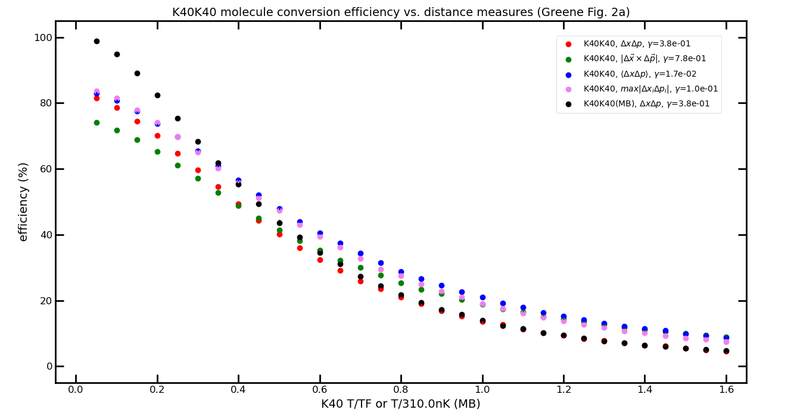
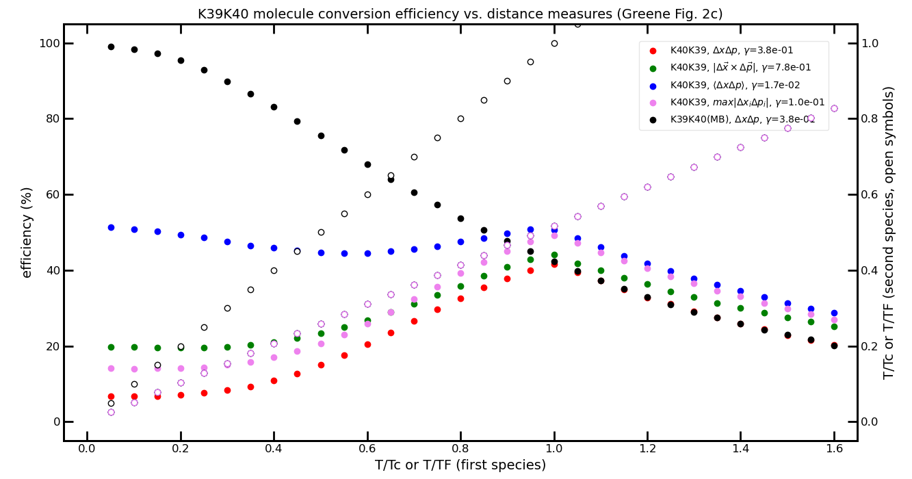
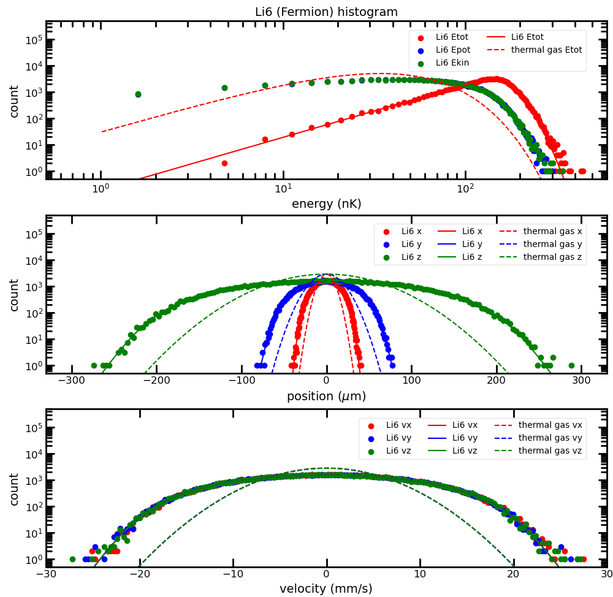
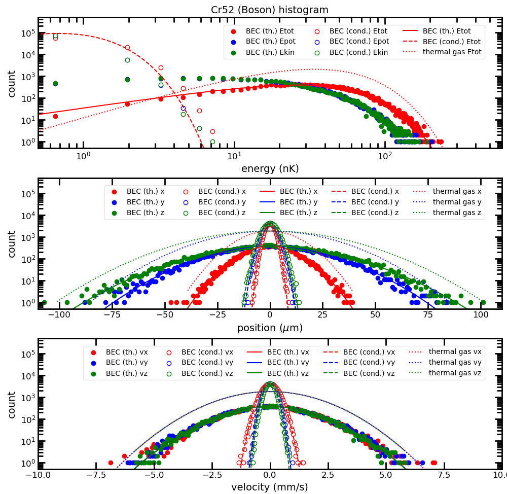

# molConv
Monte Carlo simulation of molecule creation from ultracold atoms

## Overview

This C++ code performs a static (i.e. no temporal change) Monte Carlo simulation where one or two species of ultracold atoms with Ferion or Boson statistics (including non-interacting BEC) or thermal gases are created in a harmonic trap and from which molecules are created using different molecule pairing criteria. Varying species, atom number, temperature, T/TF or T/Tc, or trap geometry allows to calculate molecule creation efficiency for different pairing criteria and to compare with experiment data. The Monte Carlo simulation with the different pairing criteria is inspired by [Tomotake Yamakoshi, Shinichi Watanabe, Chen Zhang, and Chris H. Greene, `Stochastic and equilibrium pictures of the ultracold Fano-Feshbach-resonance molecular conversion rate`, Physical Review A87, 053604 (2013)](https://journals.aps.org/pra/abstract/10.1103/PhysRevA.87.053604) [Ref. 1].

The present code originates from the version by Florian Schreck (now Amsterdam) used by the LiK experiment in Innsbruck/Austria (around 2010). The improvements include multi-threading on Windows and Linux, the implementation of the Metropolis argorithm for efficient atom generation, and the choice of different 64bit or 128bit random number generators which were extensively tested with PractRand (v0.94). The molecule search algorithm has been extended with more pairing criteria and the nearest-pair option. For future applications (like temporal evolution) a cells grid has been introduced but which is not yet efficiently used. Although this code is tailored for the specific purpose of molecule formation it might serve as a starting point for extension and other studies.

The Monte Carlo simulation shows that for the mass-balanced case only T/TF or T/Tc matters and the difference between the pairing criteria behave is negligible apart of a scaling factor for each cirterium chosen to match the experiment. Below a figure for the mass-balanced Fermi-Fermi case (similar to Fig.2a of Ref.1, MB = thermal gas):



For the mass-imbalanced case at sufficient low temperature the different criteria deviate sufficiently from each other such that by comparison with experiment one might be able to pinpoint the microscopic origin of the pairing mechanism. Below a figure for the mass-imbalanced Fermi-Bose case (similar to Fig.2c of Ref. 1, MB = thermal gas):



In our experiment we have Li6 and different isotopes of Chromium (50, 52 and 53) and we can create molecules with all combinations of species with a mass imbalance of about 8 and different combinations of statistics. We measure the pairing efficiency at different T/TF or T/TF of these mixtures and the comparison with the results of the Monte Carlo simulation might lead to a better understanding of the microsopic picture.

The project structure is below:

```
├── figures                     example figures
├── log                         PractRand 0.94 logfiles
├── params                      example parameter files
├── python                      python scripts
└── src                         C++ source code
    └── molConv_Visual-Studio   Visual Studio (2019) project
```

## Compiling

The [src folder](/src) contains the C++ files and the `Makefile` for easy compilation on Linux systems (tested with `g++` on Ubuntu 22.04). In the terminal just type `make` in the folder containing the source files. The compilation requires pthreads (part of the newer gcc/g++ versions) and has no other dependencies.

For compilation on Windows a Visual Studio (2019) solution can be found in the the [src/Visual-Studio folder](/src/molConv_Visual-Studio). Open the solution file `molConv_Visual-Studio.sln` with Visual Studio (upgrade project to newer version when requested) and compile it with `Build - Build Solution`. The `molConv_Visual-Studio.exe` file is created in the `/x64/Release` folder of the Visual Studio project folder.

The project can however also easily created manually: create an empty project, add all .cpp, .hpp and .h files in the `/src` folder (at the moment 7 files) to the project and select `x64` and `Release`. Check that in `Project - <project name> properties - Optimization` is set to full (`/O2`), fast code is favored (`/Ot`) and full code optimization (`/GL`) is selected. Command arguments can be selected for debugging in `Project - <project name> properties - Debugging` such that by pushing the green arrow it is launched with the specified arguments after automatic re-compilation. The project has no additional dependencies and should be easily compiled. 

The Lehmer64/128 random number generators use 128bit integer arithmetics which is not available on actual Visual Studio compilers. Therefore, a custom implementation (using the gcc/g++ source code) is provided. It should however be possible to compile the project on Visual Studio with the `clang` compiler which is natively supporting 128bit integers. I have not yet tested this however.

A [list of compile options](#list-of-compile-options) can be found at the end of this page.


## How to use

The most basic usage is to execute `./molConv` or `molconv.exe` from the command line where a few command line arguments can be given [see list of command line arguments below](#list-of-command-line-arguments). 

MolConv accepts many more options which can be specified in the parameter file using the `-p` argument. The [params folder](/params) has a few example parameter files.

For easiest use of MolConv the `molConv_run.py` python script is provided in the [python folder](/python) which not only generates the parameter file, but also launches molConv and collects the results saved into the result file. It generates a result .csv file with the averaged result from all repetitions and plots the results. In the python file please check the path to the molConv executable and to the result file (relative paths like `./tmp/result.txt` with forward slash work also on Windows), select the `figure` you want to produce, if you want to run the simulation (`recalc = True`) or if you just want to plot the result (`recalc = False`).

> [!NOTE]
> At the moment not all figures are working since I have changed the code without testing all figures again. Use `figure = None` as reference. I'll update this soon.

The most important output file is the result file (specified by the `result_file` parameter in the parameter file). This is a text file which summarizes all input values, calculated T/TF and T/Tc and other critical parameters of the species, provides the molecule conversion efficiency and more information about the generated molecules. It gives information for each repetition of the simulation and summarizes the result. Since it contains partially redundant information (atoms and molecules are summarized even when only a single sub-species is present) it is a bit hard to read, so its recommended to use the `molConv_run.py` python script to parse the file automatically for the relevant information. It generates a .csv file with the averaged result which is easier to handle.


## List of command line arguments

| argument   | description                                                                 | example         | use case           |
|------------|-----------------------------------------------------------------------------|-----------------|--------------------|
| -p \<file> | read options from parameter file \<file name>                               | -s myParams.txt | simulation         |
| -g \<RNG>  | select random number generator \<RNG name>                                  | -g Lehmer128    | simulation         |
| -s \<seed> | give min. 1 comma-separated seed value within {}, no spaces, hex with 0x    | -s {1,2,0xab}   | reproduce old simulation |
| -tI        | stream uniform distributed 64bit integer to stdout                          | -tI             | PractRand          |
| -tD        | stream uniform distributed double converted to 64bit integer to stdout      | -tD             | PractRand          |
| -tN        | stream normal  distributed double converted to 64bit integer to stdout      | -tN             | PractRand          |
| -ti        | stream uniform distributed 32bit integer to stdout                          | -ti             | PractRand          |
| -td        | stream uniform distributed float converted to 32bit integer to stdout       | -td             | PractRand          |
| -tn        | stream normal  distributed float converted to 32bit integer to stdout       | -tn             | PractRand          |

The parameter file is used for full customization of the simulation and it helps to document the used parameters. [See below for a list of possible paramter entries](#list-of-parameter-file-entries).

See [see list of random number generators below](#list-of-recommended-random-number-generators) for the possible random number generators. 

If no seed value is given to MolConv then it uses `std::random_device` to generate two **hardware seed** values which is used to generate a seed sequence for the used random number generator which is different for each thread. These two hardware seed values are printed on the screen and are saved into the result file such that if needed one can input them to a subsquent call to MolConv to repeat the exact same simulation.

The `-t#` options are used only for the tests with PractRand. They specifying bit width (32bit = `-ti, -td, -tn` or 64bit = `-tI, -tD, -tN`) of random numbers and if integer `-tI, -ti` or uniform distributed float `-tD, -td` or normal-distributed float `-tN, -tn` should be tested. The floating-point numbers are converted by MolConv back into uniform distributed integers which PractRand can test. For details on the PractRand test see [discussion of random number generators below](#list-of-recommended-random-number-generators).


## List of parameter file entries

| parameter               | description                                                | remark                                  |
|-------------------------|------------------------------------------------------------|-----------------------------------------|
| species\_0              | name of first atom                                         |                                         |
| species\_1              | name of second atom                                        | *                                       |
| num_species             | number of species. must be 1 or 2                          | must be 1 or 2                          |
| statistics\_0           | statistics of first atom                                   | see list of statistics                  |
| statistics\_1           | statistics of second atom                                  | see list of statistics, *               |
| statistics\_mol         | statistics of molecules                                    | see list of statitsics                  |
| mass\_0                 | mass of first atom in amu                                  |                                         |
| mass\_1                 | mass of second atom in amu                                 | *                                       |
| N\_0                    | atom number of first atom                                  |                                         |
| N\_1                    | atom number of second atom                                 | *                                       |
| T\_0                    | temperature of first atom in nK                            |                                         |
| T\_1                    | temperature of second atom in nK                           | *                                       |
| fx\_0                   | harmonic trapping frequency of first atom on x-axis in Hz  |                                         |
| fy\_0                   | harmonic trapping frequency of first atom on y-axis in Hz  |                                         |
| fz\_0                   | harmonic trapping frequency of first atom on z-axis in Hz  |                                         |
| fx\_1                   | harmonic trapping frequency of second atom on x-axis in Hz | *                                       |
| fy\_1                   | harmonic trapping frequency of second atom on y-axis in Hz | *                                       |
| fz\_1                   | harmonic trapping frequency of second atom on z-axis in Hz | *                                       |
| cx                      | offset of second atom center x-position in mu              | default = 0, *                          |
| cy                      | offset of second atom center y-position in mu              | default = 0, *                          |
| cz                      | offset of second atom center z-position in mu              | default = 0, *                          |
| size\_0                 | calculation size and energy scaling                        | default = 1.0                           |
| size\_1                 | calculation size and energy scaling                        | default = 1.0, *                        |
| error\_allowed          | chemical potential calc. goal |delta N/N|                  | default = 1e-10                         |
| step\_size              | chemical potential calc. initial step size                 | default = 0.1                           |
| repeat                  | repetition of simulation                                   | default = 1                             |
| distance\_measure       | molecule pairing criterion                                 | see list of pairing criteria            |
| gamma                   | maximum distance to take for given pairing criterium       | obtained by comparison with experiment  |
| threads                 | number of threads                                          | default = 8                             |
| num\_bins               | number of bins for histogram                               | default = 300                           |
| random\_number\_generator | random number generator                                  | see list of random number generators, default = 'Lehmer128' |
| distribution\_generator | distribution generator                                     | see list of distribution generators     |
|                         |                                                            | default = Metropolis                    |
| seed                    | seed values given as comma-separated list within {}        | default = "" = hardware seed, min. 1 value, no spaces allowed |
| result\_file            | path and filename of result text file                      | default = result.dat                    |
| histogram\_file         | path and filename of histogram text file                   | default = "" = no file created, **      |
| export\_atom\_0         | path and filename of exported first atoms csv file         | default = "" = no file created, **      |
| export\_atom\_1         | path and filename of exported second atoms csv file        | *, **, default = "" = no file created   |
| export\_molecule        | path and filename of exported molecules csv file           | default = "" = no file created, **      |
| neighbors\_file         | path and filename of exported neightbors csv file          | at the moment disabled                  |
| neighbors\_num          | number of neighbors to export                              | at the moment disabled                  |
| find\_nearest           | if nonzero molecule search pairs nearest neighbors (slow), otherwise first matching pair is used (faster). | default = 0 |

`*` can only be given for num_species == 2

`**` histogram, atoms and molecule file names are automatically appended with species/molecule name and repetition

## List of statistics

These statistics are implemented. For `BoseEinstein` two seperate sub-species are generated (`thermal` and `condensed`) depending on the thermal and BEC fraction. For each sub-species combination a molecule is created. This is also the reason why the result file contains summary of atoms and molcules. For the BEC part **non-interacting** (harmonic ground-state wavefunction) is assumed using the truncated Wigner approximation, see Equ. 4 in Ref. 1.

| statistics               | description                                                                                         |
|--------------------------|-----------------------------------------------------------------------------------------------------|
| FermiDirac               | Ideal Fermi gas, see Ketterle, Durfee, Stamper Kurn, Making, probing and understanding Bose-Einstein condensates, https://arxiv.org/abs/cond-mat/9904034                                                                              |
| BoseEinstein             | Non-interacting BEC and thermal Bose gas, see Wolfgang Ketterle, Martin W. Zwierlein, Making, probing and understanding ultracold Fermi gases, https://arxiv.org/abs/0801.2500                                                             |
| MaxwellBoltzman          | Thermal gas, see Refs. for other statistics                                                         |.

Following two figures show example histograms for 100k Li6 atoms (Fermion, left) at T/TF = 17nK / 170nK = 0.1 and 100k Cr52 atoms (Boson, right) at T/Tc = 17nK / 30nK = 0.6 with 80% condensed fraction. For Li6 the position and velocity axis is 3x wider than that of Cr52. The images can be found in the [figures folder](/figures). They were created with the `molConv_dist.py` python script in the [python folder](/python).





## List of pairing criteria

These are the possibile pairing criteria which include the ones from Ref. 1.

| criterium                  | description                                                                    | Ref. 1 criterion |
|----------------------------|--------------------------------------------------------------------------------|------------------|
| delta\_x                   | real space distance                                                            | -                |
| delta\_v                   | velocity difference                                                            | -                |
| delta\_x*delta\_v          | momentum-space distance in center of mass frame                                | -                |
| delta\_x*delta\_p          | momentum-space distance                                                        | 1                |
| cross(delta\_x^,delta\_p^) | partial waves                                                                  | 2                |
| <delta\_x*delta\_p>        | phase-space volume                                                             | 3                |
| max\|delta\_xi*delta\_pi\| | all individual phase-space coordinates must match                              | 4                |


## List of distribution generators

There are only two possible distribution generators available. `Metropolis` is the default since it is much faster, but it creates a less precise distribution than the classical rejection-sampling algorithm which is extremely slow even on multiple threads. I keep both here in case one has to check the effect of the more noisy Metropolis algorithm.

| distribution generator   | description                                                                                         |
|--------------------------|-----------------------------------------------------------------------------------------------------|
| rejection-sampling       | Original sampling method, extremely slow, but produces a very precise distribution.                 |
| Metropolis               | Very fast sampling method, produces more variation of the samples.                                  |

<!-- 
would be nice to show here a comparison of the different distributions generated
-->

## List of recommended random number generators

> [!WARNING]
> These random number generators are not suitable for cryptographic purpose!

These random number generators (RNGs) are enabled by default and are recommended for use in the Monte Carlo simulation. 

All of these RNGs have been tested extensively with the PractRand (v0.94) test suite (using the `molConv_PractRand.py` script, in the [python](/python) folder, together with the [command line arguments `-t#`](#list-of-command-line-arguments). All, except Wyhash64, fail the `-tI` test but pass the `-tD` test (for > 1TB). In the first test the generated uniform-distributed random (64bit) numbers are sent directly to PractRand while in the second test the derived random double-precision floats (in the range 0..1) are converted back into 64bit integers before sending to PractRand. The conversion from double gives only 53bits which requires that two random doubles are combined. This procedure obviously masks the correlations between the bits generated by the original RNG. The Lehmer generators pass however PractRand 0.93 test (see Ref. 6 and comments in Ref. 3) but they intrinsically fail more modern statistical tests. 

Since the `-tD` test passes which is more close to the use case here I **beleive that** all of the recommended RNGs are suitable for Monte Carlo simulations. If you want to be sure you can make a comparison simulation with `Wyhash64` which passes both the `-tI` and `-tD` tests. This is more modern but not as established as the other generators.

All of tese RNGs fail the PractRand test with the `-tN` option, i.e. where the normal-distributed random doubles are converted back to a uniform distribution. I do not consider this as a serious flaw since most likely the problem is the conversion back into uniform distribution and not of the normal-distributed random numbers. These are needed for the `Metropolis` algorithm. If you want to be sure you can use the older `rejection-sampling` method for atom generaton - which is much slower but requires only the uniform distribution tested with the `-tD` option.

The only recommended RNG from the c++11 standard library is `MersenneTwiswer64` which is used internall by MolConv to generate a unique and variable size seed sequence used to seed all other RNGs for each thread. This overcomes the limitations in the implemenation of `std::seed_seq` which (on Ubuntu 22.04) creates for each call to `generate` always the same sequence of seed values and cannot be reset to a new state. `MersenneTwister64` can be used also as RNG for the MonteCarlo simulation, but its clearly slower than the other RNGs and fails also PractRand test as Lehmer but at much larger size.

MolConv includes also [non recommended random number generators](#list-of-not-recommended-random-number-generators) which, as the name suggested are not recommended for Monte Carlo simulations, but for testing purpose.

| RNG               | description                                                    |speed | Ref. | PR. `-tI` fails   | 
|-------------------|----------------------------------------------------------------|------|------|-------------------|
| MersenneTwister64 | From c++11 standard library, period 2^19937-1.                 | slow |      | BRank(12) @ 512GB |
| Lehmer64          | Linear congruential generator, state 128bit, period unclear    | fast | 2,3  | TMFn @ 64GB       |
| Lehmer128         | Linear congruential generator, state 128bit, period 2^126      | fast | 3,4  | TMFn @ 64GB       |
| Wyhash64          | more modern, state 64bit, unclear period, passes PractRand!    | fast |   5  |   -               |


Ref. 2: 
D. H. Lehmer, Mathematical methods in large-scale computing units. Proceedings of a Second Symposium on Large Scale Digital Calculating Machinery; Annals of the Computation Laboratory, Harvard Univ. 26 (1951), pp. 141-146.

Ref 3:
https://lemire.me/blog/2019/03/19/the-fastest-conventional-random-number-generator-that-can-pass-big-crush/
https://github.com/lemire/testingRNG/blob/master/source/lehmer64.h

Ref. 4:
https://en.wikipedia.org/wiki/Lehmer_random_number_generator
P L'Ecuyer,  Tables of linear congruential generators of different sizes and good lattice structure. 
Mathematics of Computation of the American Mathematical Society 68.225 (1999): 249-260.

Ref. 5:
https://github.com/lemire/testingRNG/blob/master/source/lehmer64.h
adapted to this project by D. Lemire, from https://github.com/wangyi-fudan/wyhash/blob/master/wyhash.h

Ref. 6:
https://www.pcg-random.org/posts/does-it-beat-the-minimal-standard.html
https://www.pcg-random.org/posts/too-big-to-fail.html

## List of not recommended random number generators

> [!WARNING]
> Do not use these random number generators! They are not even suitable for the Monte Carlo simulation!

These are for reference and testing purposes only! They have a very limited internal state and short period (`WELL1024` might be an exception and `Ranlux48` is intermediate). These are normally disabled and must be enabled by compiling with the (not recommended) option `REAL_PRECISION` = `REAL_SINGLE` which reduces the floating point precision to single. Using `Lehmer32` with the very inefficient `rejection-sampling` method and the less efficient method to generate random floating-point values I have observed clear `noise` in the y-axis histograms already for 2x15k generated atoms! Changing to `Lehmer64` this noise disappears.

| RNG               | description                                                                                                | 
|-------------------|------------------------------------------------------------------------------------------------------------|
| MinStd            | Minimum standard from c++11 standard library, 32bit state                                                  |
| Ranlux24          | From c++11 standard library, 24bit state, very slow                                                        |
| Ranlux48          | From c++11 standard library, 48bit state, very slow                                                        |
| Lehmer32          | Original random number generator used by Florian, fast, similar or even the same as MinStd                 |
| WELL1024          | Copied from one of my old codes, supposed to be good at that time, large internal state, needs many seed values. Passed a small size `-td` test but fails `-ti` (should be checked). |

<!-- 
try if can reproduce the noise which I have seen with Lehmer32 and rejection sampling. this was long time ago.
-->

## List of compile options

These are the most important compile time options found in the `MoleculeConversion.h` and `random.hpp` header files.

| option                   | description                                                                                         |
|--------------------------|-----------------------------------------------------------------------------------------------------|
| \_DEBUG                  | If defined additional debugging code is executed and more output is generated which slows down execution. |
| CLASS\_UINT128           | If defined uses the header file `uint128.h` to implement uint128\_t arithmetics. |
| REAL\_PRECISION          | If this is set to REAL\_DOUBLE double precision is used (recommended), otherwise single precision (not recommended). Single precision can be tested if faster calculation is possible (had no big effect) and to enable the not recommended 32bit random number generators |
| USE\_OLD\_MOLSEARCH      | If defined uses the older molecule search code from version v1.2 (this does not supports all pairing criteria). I use this to test if a new version gives the same result and as calculation time benchmark. | 
| SEED\_VALUES\_NUM        | Number of hardware seed values generated. Default = 2 is a good compromize of large enough possibilities and not loosing too much entropy by excessive use. |
| STREAM\_DATA\_OUT        | If defined gives the number of samples which are output in parallel on stdout and stderr by RNG\_stream for tests '-tI' and '-ti'. This allows to debug if on Windows the pipe is in text or binary mode which is needed for PractRand to work properly. |
| TO\_DOUBLE               | If set to `MULT` (default) uses multiplication to convert random integer to floating point values. In the previous version (until v1.5) it was set to `MANT_EXP` which does not need multiplication and is therefore slightly faster, but looses one bit resolution of the random numbers - which is not nice (however passes PractRand `-tD` test). | 


